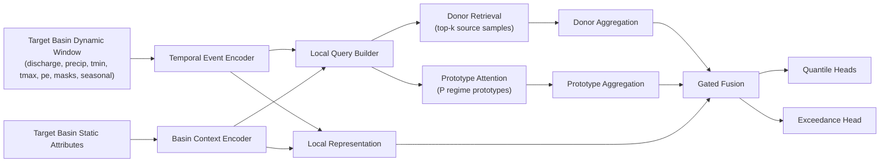

# HydroTail Retrieval-Prototype Tail Network / Detailed Architecture Sketch / 2026-03-24

## 1. Purpose

This sketch defines a new model line for the paper-facing strict ungauged setting.

The model is designed for:

- `prediction in ungauged basin`
- no target-basin `specific_conductance` history in the input
- multi-horizon forecasting
- probabilistic and tail-aware prediction

The working paper name can be:

- `HydroTail-RPT`
- full expansion: `HydroTail Retrieval-Prototype Tail Network`

The recommended code-level model key can be:

- `seq_retrieval_prototype_tail`

Implementation status:

- `v1` code path has now been added to the repository
- current `v1` uses station-level donor memory plus learnable prototype tokens
- a future `v2` can still upgrade donor memory from station-level to sample-level if needed

## 2. Why this model is worth adding

The current main model family is solid, but still looks like a strong baseline:

- exogenous drivers
- static basin features
- optional graph information
- quantile head + exceedance head

That is useful, but still relatively conventional.

If we want one additional model-side contribution that fits the paper story, the key question should be:

> When the target basin has no conductance history, how can the model explicitly borrow knowledge from hydrologically similar source basins?

This is exactly where a retrieval-style transfer model is better motivated than simply using a larger Transformer.

## 3. Main design idea

For each target sample, the model should do three things:

1. encode the target basin and its recent hydro-climatic forcing window
2. retrieve relevant donor signals from source basins
3. fuse local and donor knowledge before tail-aware prediction

The main novelty is not “a fancier encoder”, but:

- explicit donor-basin retrieval
- regime-aware prototype memory
- tail-aware probabilistic output under strict ungauged constraints

## 4. Setting and constraints

### 4.1 Strict ungauged constraint

At inference time, the model must not use:

- target-basin `specific_conductance`
- target-basin `specific_conductance` lag features
- target-basin `specific_conductance` rolling features

Allowed inputs are:

- exogenous dynamic drivers:
  - `discharge`
  - `precip`
  - `tmin`
  - `tmax`
  - `pe`
- dynamic masks and gap indicators
- seasonal signals
- static basin attributes
- cross-basin information learned from source basins

### 4.2 What is allowed during training

Training basins are gauged, so their future conductance labels are available for supervision.

This means the model is allowed to learn donor memories and prototypes from source-basin training examples.

This does not violate the strict ungauged setting, because the target basin still has no conductance input at test time.

## 5. High-level architecture



## 6. Detailed module design

## 6.1 Temporal Event Encoder

### Input

For one sample `(i, t)`:

- lookback window length `L`
- dynamic matrix `X_{i,t} ∈ R^(L × D_dyn)`
- mask matrix `M_{i,t} ∈ R^(L × D_dyn)`
- seasonal/context features `C_{i,t} ∈ R^(L × D_ctx)`

The practical concatenated input is:

`U_{i,t} = [X_{i,t} || M_{i,t} || C_{i,t}]`

### Recommended encoder

Use a `TCN` encoder first, not a Transformer.

Reason:

- it is easier to implement in the current codebase
- your current `SequenceTailModel` already has a strong TCN path
- daily hydro-climatic forcing windows often do well with causal convolutions

So the default event encoder should be:

- `TemporalEventEncoder = TCN`

Output:

- `h_event ∈ R^d`

This vector represents the current hydro-climatic state of the target basin.

## 6.2 Basin Context Encoder

### Input

Static basin feature vector:

- `s_i ∈ R^(D_stat)`

### Encoder

Use a small `MLP`:

`h_basin = f_stat(s_i)`

Output:

- `h_basin ∈ R^d`

This vector encodes long-term basin identity in a transferable way without using raw station ID.

## 6.3 Local Representation

Build a local target-sample representation:

`h_local = f_local([h_event || h_basin])`

This is the representation of the current target basin under the current forcing regime.

Output:

- `h_local ∈ R^d`

## 6.4 Donor Memory Bank

This is the core transfer module.

### Memory items

For each source-basin training sample `(j, τ)`:

- encode its exogenous sequence into `h_event^(j,τ)`
- encode its static basin features into `h_basin^j`
- build a memory key:
  - `k_(j,τ) = f_key([h_event^(j,τ) || h_basin^j])`
- build a memory value:
  - `v_(j,τ) = f_value([h_event^(j,τ) || h_basin^j])`

Memory keys are used for retrieval.
Memory values are used for prediction transfer.

### Important point

The memory value does not need to store raw conductance.

It can store:

- a learned latent representation
- a tail-aware latent representation
- optionally a target-conditioned hidden state learned through forecasting supervision

This is safer and more flexible than directly copying labels.

## 6.5 Query Builder

For the target sample:

`q_(i,t) = f_query([h_local])`

This query should represent:

- what kind of basin this is
- what kind of hydro-climatic event is currently happening

## 6.6 Donor Retrieval

Retrieve top-k donor samples from the source memory bank:

`score_(i,t,j,τ) = sim(q_(i,t), k_(j,τ))`

Recommended similarity:

- cosine similarity or scaled dot-product similarity

Then:

- take top-k donor items
- normalize with softmax temperature `τ_r`

`α_n = softmax(score_n / τ_r)`

Aggregated donor representation:

`h_donor = Σ_n α_n v_n`

### Retrieval restrictions

To reduce noisy donors, a practical first implementation can constrain candidate donors by:

- same season bin or nearby day-of-year
- graph-neighbor candidates first, then global fallback
- top-k static-similar basins as a candidate pool

This helps retrieval stay physically plausible.

## 6.7 Prototype Memory

This is what makes the model look less ordinary than pure top-k retrieval.

### Idea

Top-k donor retrieval is sample-level.
Prototype memory is regime-level.

We define `P` learnable regime prototypes:

- `p_1, p_2, ..., p_P`

Each prototype is intended to capture a reusable conductance-response regime, for example:

- snowmelt-like regime
- arid low-flow concentration regime
- rainfall pulse regime
- reservoir-regulated regime

### Prototype attention

The same target query attends to the prototypes:

`β = softmax(sim(q_(i,t), p_m))`

Then:

`h_proto = Σ_m β_m p_m`

### Why both donor retrieval and prototypes

They play different roles:

- `h_donor`: instance-level transfer from specific source events
- `h_proto`: regime-level smoothing and abstraction

This combination is more stable than retrieval alone when the nearest donors are noisy.

## 6.8 Gated Fusion Module

Fuse three sources:

- `h_local`
- `h_donor`
- `h_proto`

Recommended fusion:

`g = sigmoid(W_g [h_local || h_donor || h_proto])`

`h_transfer = W_t [h_donor || h_proto]`

`h_fused = g ⊙ h_local + (1 - g) ⊙ h_transfer`

This lets the model decide:

- when to trust local exogenous evidence
- when to rely more on donor transfer

## 6.9 Tail-aware Output Heads

Keep the current HydroTail output design.

For each target:

- quantile heads:
  - `q0.1`
  - `q0.5`
  - `q0.9`
  - `q0.95`
  - `q0.99`
- exceedance head:
  - probability of exceeding the training threshold

Point prediction remains:

- `point = q0.5`

This is important because it lets the new model plug into the current training and evaluation pipeline with minimal change.

## 7. Recommended target scope

For the paper-facing main line, this model should first be built for:

- `conductance` only

Do not start with:

- `conductance + turbidity`

Reason:

- the current paper-facing line is already clearer on conductance
- turbidity still has its own data-support problems
- a new model should not multiply uncertainty across both architecture and target design at the same time

## 8. Training objective

Keep the existing main losses:

- quantile loss
- exceedance BCE loss
- non-negativity boundary loss

Total loss:

`L_total = L_quantile + λ_event * L_event + λ_boundary * L_boundary + λ_proto * L_proto_reg + λ_retr * L_retr_reg`

### Mandatory losses

- `L_quantile`
- `L_event`
- `L_boundary`

### Optional regularizers

Use only if needed in `v2`:

- `L_proto_reg`
  - encourage prototype diversity
  - avoid all prototypes collapsing to the same regime
- `L_retr_reg`
  - encourage sparse but not degenerate retrieval
  - optionally penalize unstable donor-attention entropy

Recommended implementation strategy:

- `v1`: no extra regularizer
- `v2`: add prototype diversity regularization if prototype collapse appears

## 9. Inference procedure

For a target ungauged basin-day sample:

1. build `h_event` from exogenous lookback window
2. build `h_basin` from static attributes
3. form `h_local` and query `q`
4. retrieve donor source samples from the training memory bank only
5. attend to the global prototype set
6. fuse `h_local + h_donor + h_proto`
7. output quantiles and exceedance probability

No target-basin conductance history is needed anywhere in this path.

## 10. Why this model fits the paper story

This model is aligned with the manuscript better than a generic “bigger deep net” because its main idea directly answers the main scientific setting:

- the target basin is ungauged for conductance
- prediction must come from transferable cross-basin structure
- the model therefore needs a mechanism to borrow knowledge from similar source basins

That makes the innovation easier to justify in the paper.

The model-side claim becomes:

> Instead of relying only on shared parameters, the model performs explicit donor-basin retrieval and regime-prototype transfer for strict ungauged conductance forecasting.

## 11. Relation to current HydroTail code

## 11.1 Recommended implementation entry point

Do not rewrite the current codebase from scratch.

The best entry point is to add a new sequence model class alongside the current `SequenceTailModel`.

Recommended new files:

- `hydrotail/models/retrieval_tail.py`

Recommended new class names:

- `RetrievalPrototypeTailModel`
- or `SequenceRetrievalPrototypeTailModel`

Recommended new model key in config:

- `seq_retrieval_prototype_tail`

## 11.2 Minimal code integration path

Expected edits:

1. [__init__.py](/F:/jupyter_notebook/wat_quality_pred/hydrotail/models/__init__.py)
   - export the new model class
2. [train.py](/F:/jupyter_notebook/wat_quality_pred/hydrotail/train.py)
   - add a new branch in `_instantiate_model()`
3. new file:
   - `hydrotail/models/retrieval_tail.py`
4. optional:
   - reuse helper functions from [sequence_tail.py](/F:/jupyter_notebook/wat_quality_pred/hydrotail/models/sequence_tail.py)
   - reuse graph utilities from [graph_backends.py](/F:/jupyter_notebook/wat_quality_pred/hydrotail/models/graph_backends.py)

## 11.3 Recommended implementation strategy

### Stage A: implementable `v1`

Build:

- TCN event encoder
- static basin encoder
- source memory bank
- top-k donor retrieval
- gated fusion
- existing quantile + exceedance heads

Do not include in `v1`:

- full prototype learning
- complicated contrastive loss
- graph + retrieval hybrid coupling

This version should already be publishable as a cleaner and lower-risk new model.

### Stage B: ambitious `v2`

Add:

- learned regime prototypes
- prototype diversity regularization
- optional graph-aware donor restriction or graph-enhanced retrieval

`v2` is where the model becomes more distinctive, but it should only come after `v1` is stable.

## 12. Suggested config block

```yaml
run:
  models:
    - seq_retrieval_prototype_tail

models:
  seq_retrieval_prototype_tail:
    device: cuda:0
    encoder_type: tcn
    hidden_dim: 128
    dropout: 0.1
    batch_size: 256
    epochs: 25
    patience: 5
    learning_rate: 0.001
    weight_decay: 0.0001
    top_k_donors: 16
    retrieval_temperature: 0.2
    candidate_pool: graph_or_global
    candidate_pool_size: 128
    num_prototypes: 8
    use_prototypes: true
    use_graph_restriction: true
```

## 13. Main ablations for the paper

If this model is implemented, the most meaningful ablations are:

1. `local only`
   - remove donor retrieval
   - remove prototypes
2. `local + donor retrieval`
   - donor retrieval on
   - prototypes off
3. `local + donor retrieval + prototypes`
   - full model
4. `global retrieval` vs `graph-restricted retrieval`
5. `top-k donor only` vs `prototype only` vs `both`

These ablations map directly to the method story and are stronger than generic “hidden dim 64 vs 128” style experiments.

## 14. Main hypotheses

The model should be built to test the following hypotheses:

- `H1`: explicit donor retrieval improves strict ungauged conductance forecasting over a pure shared-parameter sequence encoder
- `H2`: regime prototypes improve stability and tail-event discrimination beyond raw top-k donor retrieval
- `H3`: retrieval/prototype transfer becomes more valuable at medium and longer horizons than at the shortest horizon
- `H4`: graph-restricted donor search is more physically meaningful than unrestricted retrieval

## 15. Risks and cautions

### 15.1 Main risk

If the retrieval module is too complicated, it may become hard to prove whether gains come from:

- the retrieval idea itself
- bigger model capacity
- more tuning effort

So `v1` should stay compact.

### 15.2 Do not break the strict ungauged claim

At no point should the target-basin conductance history be included in:

- query construction
- local encoder input
- donor matching features

If that happens, the paper story breaks.

### 15.3 Retrieval may overfit source-basin identities

To reduce this risk:

- prefer static-feature-based or graph-restricted candidate pools
- avoid any raw station-ID embedding
- evaluate with multiple random seeds

## 16. Recommended paper positioning if this works

If the model works, the paper can claim:

1. a strict ungauged conductance forecasting benchmark
2. a donor-aware retrieval-prototype architecture for cross-basin transfer
3. tail-aware probabilistic prediction under unseen-station and future-period extrapolation

This is a much stronger contribution package than “a slightly modified MLP/TCN.”

## 17. Bottom line

If we want exactly one new model that looks materially less ordinary while still matching the paper's strict ungauged story, this is the best direction:

- keep the current HydroTail heads
- keep the current strict ungauged input rule
- add donor retrieval
- add regime prototypes
- start with a TCN-based `v1`

That gives a model contribution that is both more publishable and still feasible inside the current repository.
